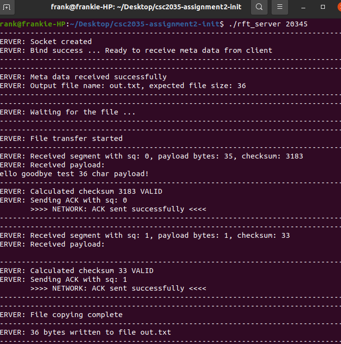
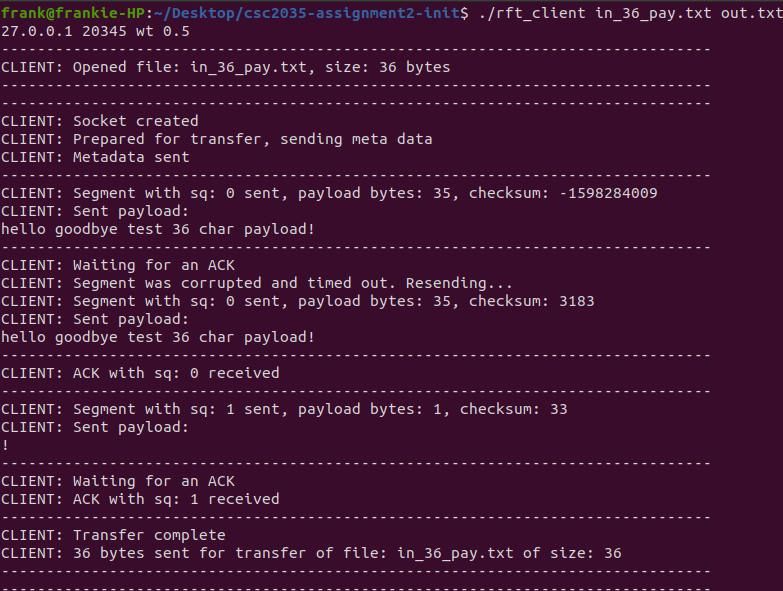
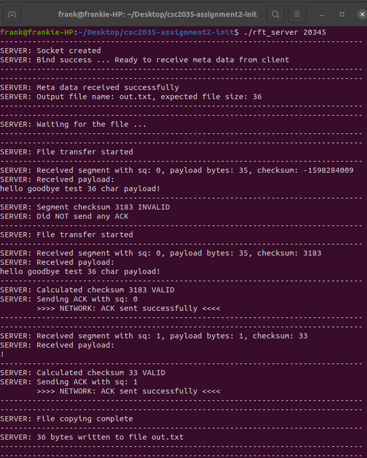

# Reliable-FTP

# About

This project was coursework as part of the Operating Systems and Networks module during my second year at Newcastle University.

# Aim

This coursework gives you the opportunity to develop your skills in network socket programming using
the C programming language. The aim of this coursework is to build a Reliable File Transfer (RFT)
protocol that works on top of UDP and guarantees reliable delivery of a file between a client and a
server. 

# What I learned during this coursework

* The use sockets in C programming
* The 
* The use of socket and file descriptors
* The relationship between client and server across networks.
* Sendto() and recv() for use with data segments as packets and acknowledgements between the client and the server.
* How corruptions in the data segment are resolved and retransmitted after a timeout placed on the socket.

# Example Scenarios

### Normal transfer protocol with positive acknowledgement
#### Client Terminal
1.	The socket is created. 
2.	One of the first things the client does is send the metadata which contains the size of the file which is 36 bytes and the name of the output file. 
3.	The first segment with sq 0 is sent to the server, it contains 35/36 of the bytes for the file. The calculated checksum is also displayed along with the payload of the 35 bytes. 
4.	The client waits to receive and acknowledgement from the server. 
5.	An ACK with sq:0 is received and the client can send the next segment. 
6.  The second segment with sq 1 is sent to the server, it contains the 36th byte for the file. 
7.  The client waits to receive and acknowledgement from the server. 
8.	An ACK with sq:0 is received and the transfer is completed as the 2nd segment was the final one.

#### Server Terminal
1.	Socket is created and is ready for a client to send metadata. 
2.	Meta data received from client containing output file name and expected file size. 
3.	Server waits for the file transfer to start. 
4.	Server receives the first segment of 35 bytes. 
5.	Server calculates the checksum and returns an acknowledgement as the checksum was valid. 
6.	Server receives the second segment of 1 byte. 
7.	Server calculates the checksum and returns and acknowledgement as the checksum was valid. 
8.	The second segment was the last segment so the file transfer is complete. 
9.	The bytes are written to the output file.

### PAR protocol with re-transmission after timeout

#### Client Terminal
1.	The socket is created. 
2.	Metadata sent to server. 
3.	The first segment with sq 0 is sent, as you can see the checksum is a very large negative number which means the first segment has been corrupted. 
4.	The client waits for an acknowledgement from the server but never receives one and times out. 
5.	The first segment with sq 0 is resent. 
6.	An ACK with sq 0 is received from the server. 
7.	The second segment with sq 1 is sent to the server. 
8.	The client waits for an ACK. 
9.	The client receives an ACK from the server. 
10.	The transfer is complete.

#### Server Terminal

1.	Socket is created and is ready for a client to send metadata. 
2.	Meta data received from client containing output file name and expected file size. 
3.	Server waits for the file transfer to start. 
4.	Server receives first segment but an invalid checksum is calculated so no ACK is sent. 
5.	The server receives the segment again but this time the checksum is valid so an ACK is sent to the client. 
6.	The second segment is received and the checksum is valid so an ACK is sent to the client. 
7.	The second segment was the last segment so the transfer is complete.

